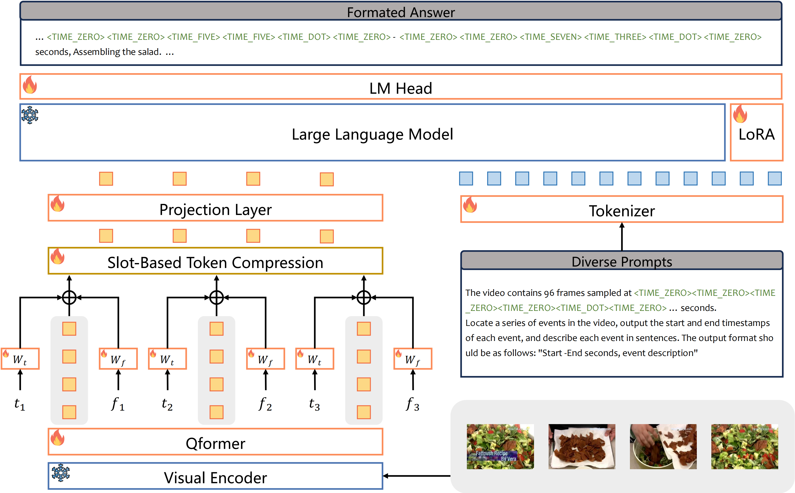

<h2 align="center"> <a href="https://arxiv.org/abs/2405.13382">VTG-LLM: Integrating Timestamp Knowledge into Video LLMs for Enhanced Video Temporal Grounding</a></h2>

<h5 align="center"> If our project helps you, please give us a star ⭐ and cite our <a href="#bibliography">paper</a>!</h2>
<h5 align="center">

[](https://huggingface.co/papers/2405.13382)
[](https://huggingface.co/Yongxin-Guo/VTG-LLM)
[](https://huggingface.co/Yongxin-Guo/VTG-LLM)
[](https://arxiv.org/abs/2405.13382)
[](https://hits.seeyoufarm.com)                


## News
- 5/28/2024, [NPU checkpoints](https://huggingface.co/Yongxin-Guo/VTG-LLM) can be fine-tuned on V100 GPU.

## Overview

We introduce 
- VTG-IT-120K, a high-quality and comprehensive instruction tuning dataset that covers VTG tasks such as moment retrieval (63.2K), dense video captioning (37.2K), video summarization (15.2K), and video highlight detection (3.9K).
- VTG-LLM, which (1) effectively integrates timestamp knowledge into visual tokens; (2) incorporates absolute-time tokens that specifically handle timestamp knowledge, thereby avoiding concept shifts; and (3) introduces a lightweight, high-performance slot-based token compression method to facilitate the sampling of more video frames.

<div align="center">
    
    <br/>
    <figcaption>Overview of VTG-LLM.</figcaption>
</div>

## Enviroments

We recommend utilizing NPU environments for training, evaluation, and fine-tuning. The environment we use can be found in [environment-npu.yaml](./environment-npu.yaml). Additionally, we have discovered that executing the script below is sufficient for most scenarios.
```
bash install_requirements.sh
```

If an NPU is not available, a V100 can also be employed for training and evaluation, but it cannot be used for fine-tuning checkpoints trained by an NPU. The necessary environments can be found in [requirements-v100.txt](./requirements-v100.txt).

## Model Checkpoints

The model checkpoint (without finetuning) is avaliable at [huggingface](https://huggingface.co/Yongxin-Guo/VTG-LLM):
```
git lfs install

git clone https://huggingface.co/Yongxin-Guo/VTG-LLM
```

## Data

See [DATA.md](./docs/DATA.md) for details. The data annotations are avaliable at [huggingface](https://huggingface.co/datasets/Yongxin-Guo/VTG-IT):
```
git lfs install

git clone https://huggingface.co/datasets/Yongxin-Guo/VTG-IT
```

## Requirments

Please download the following model checkpoints:
- EVA-ViT-g: https://storage.googleapis.com/sfr-vision-language-research/LAVIS/models/BLIP2/eva_vit_g.pth
- InstructBLIP: https://storage.googleapis.com/sfr-vision-language-research/LAVIS/models/InstructBLIP/instruct_blip_vicuna7b_trimmed.pth
- Video-LLaMA: https://huggingface.co/DAMO-NLP-SG/Video-LLaMA-2-7B-Finetuned/tree/main
- Bert: https://huggingface.co/google-bert/bert-base-uncased

### Script

#### Tuning
Config the checkpoint and dataset paths in [pretrain-slot-sample-fmt-96.yaml](./train_configs/videollama/pretrain-slot-sample-fmt-96.yaml).
Config the bert checkpoint paths in [blip2.py](./vtgllm/models/blip2.py) and [vtgllm.py](./vtgllm/models/vtgllm.py)
```
torchrun --nproc_per_node=16 train.py --cfg-path  train_configs/videollama/pretrain-slot-sample-fmt-96.yaml
```

#### Evaluation
Config the checkpoint and dataset paths in [videollama-slot-96.yaml](./eval_configs/videollama-slot-96.yaml).

Config the downstream task in [eval.sh](eval.sh).
```
bash eval.sh
```

#### Demo
You need to firstly change the path of videos and model checkpoints to your path.
```
python gradio_demo.py
```
## Recommended GPUs
* Instruction-tuning: 16xATN 910B
* Inference: 1xV100

## Acknowledgement
We are grateful for the following awesome projects:
* [TimeChat](https://github.com/RenShuhuai-Andy/TimeChat)
* [Video-LLaMA](https://github.com/DAMO-NLP-SG/Video-LLaMA)
* [MiniGPT-4](https://github.com/Vision-CAIR/MiniGPT-4)
* [FastChat](https://github.com/lm-sys/FastChat)
* [BLIP-2](https://github.com/salesforce/LAVIS/tree/main/projects/blip2)
* [EVA-CLIP](https://github.com/baaivision/EVA/tree/master/EVA-CLIP)
* [LLaMA](https://github.com/facebookresearch/llama)
* [VideoChat](https://github.com/OpenGVLab/Ask-Anything)
* [TESTA](https://github.com/RenShuhuai-Andy/TESTA)
* [VTimeLLM](https://github.com/huangb23/VTimeLLM)
* [Video-LLaVA](https://github.com/PKU-YuanGroup/Video-LLaVA)
* [entropy_estimators](https://github.com/paulbrodersen/entropy_estimators)

## Bibliography
If you find this repository helpful for your project, please consider citing:
```
@article{guo2024vtg,
  title={VTG-LLM: Integrating Timestamp Knowledge into Video LLMs for Enhanced Video Temporal Grounding},
  author={Guo, Yongxin and Liu, Jingyu and Li, Mingda and Tang, Xiaoying and Chen, Xi and Zhao, Bo},
  journal={arXiv preprint arXiv:2405.13382},
  year={2024}
}
```


